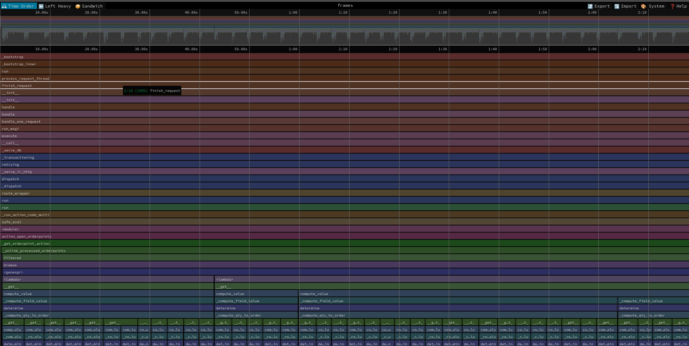
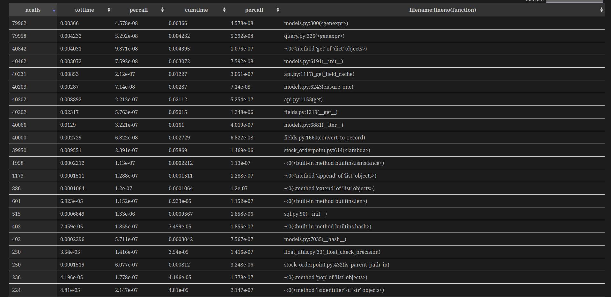

# Hangry Odoo Developer Test Assignment

## 1. Reproduce the Issue

### Environment Setup
- **Odoo Version**: 18.0  
- **PostgreSQL**: 15  
- **Seed Data**:
  - Product Template = 40,000  
  - Variants = 40,000  
  - Stock Moves = 1,000  
  - Stock.Warehouse.Orderpoint = 40,000  

### Description
When I populated `product.template` I hit a bottleneck in `odoo.cli._populate` method, so I created a Python script (`seed_product.py`) to populate `product.template`.  
I also created stock moves with another Python script (`seed_move.py`).

In `stock.warehouse.orderpoint` there is a field called **trigger**:
- With **auto** value, no problem occurred.  
- When I updated it to **manual** via SQL query, the Replenishment view became very slow.

### Steps to Reproduce
1. Login to Odoo  
2. Go to **Inventory → Operation → Replenishment**  
3. Set trigger to **manual**  
4. Wait for the loading to finish  

### Observation
- With trigger = **auto** → view load time ~ **2–4 seconds**  
- With trigger = **manual** → view load time ~ **>20 seconds**

---

## 2. Analyze the Root Cause

### Methodology
1. **Odoo Logging**
   - Enabled `log_sql` in `odoo.conf` to capture queries.
   - Saved output to `sql_replenishment.log`.

2. **Python Profiling**
   - Used `cProfile` on `action_open_orderpoints()`.
   - Visualized results with **Speedscope Flamegraph** and **Snakeviz**.

3. **SQL Analysis**
   - Reviewed queries from the log.
   - Identified repetitive queries against `stock_quant` and `stock_move`.

---

### Findings

#### Profiling (Flamegraph & Snakeviz)
- **Flamegraph** shows call stack:
  - `action_open_orderpoints` → `_get_orderpoint_action` → `_unlink_processed_orderpoints`
  - `_compute_field_value` → `determine` → **`_compute_qty_to_order`**
    

- **Snakeviz** results:
  - High call counts (40k–80k) in `fields.__get__`, `api.get`, `models.ensure_one`, `models.__iter__`.
  - `stock_orderpoint.py:<lambda>` and `stock_orderpoint.is_parent_path_in` consume significant cumulative time.
    
- This shows heavy **per-record ORM iteration**.

#### SQL Analysis
Examples from log:
```sql
SELECT SUM(quantity) AS qty, SUM(reserved_quantity) AS reserved
FROM stock_quant
WHERE company_id = %s AND product_id = %s AND location_id IN (...);

SELECT SUM(product_uom_qty - quantity_done) AS incoming
FROM stock_move
WHERE state IN ('confirmed','waiting','assigned')
  AND product_id = %s
  AND location_dest_id IN (...);

SELECT SUM(product_uom_qty - quantity_done) AS outgoing
FROM stock_move
WHERE state IN ('confirmed','waiting','assigned')
  AND product_id = %s
  AND location_id IN (...);
